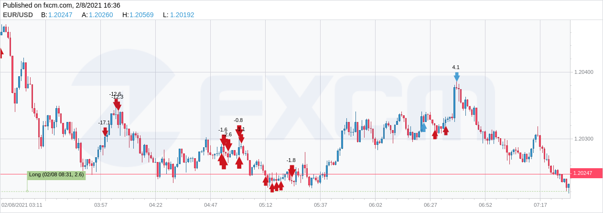

# Project Apatheia

This is an automated forex trading system built using python. The system uses a pre-trained Reinforcement Learning model to trade. Below is an example of how the model performes in the live market.

Live trading is made possible will the FXCM API and fxcmpy python library. Allowing the model the model to stream price changes and place market orders when as it makes predictions.
********

## Requirements
To run the project ensure that you have
    1. Flask v1.1.2
    2. Python 3
    3. The necessary librarys listed in requirements.txt
    4. Linux environment to perform Redis Worker Queues.
    5. Redis v6.0.10

To run the project:
````````
#run in order in seperate terminals
$ redis-server
`````````
`````````
#to activate worker thread
$ rq worker

#to start server
$ flask run
```````````
******

## Model Performance
Below are some of the live trades performed by the model. They are indicated on the candle charts as either blue or red arrows.


## References
[q-trader](https://github.com/edwardhdlu/q-trader) 
