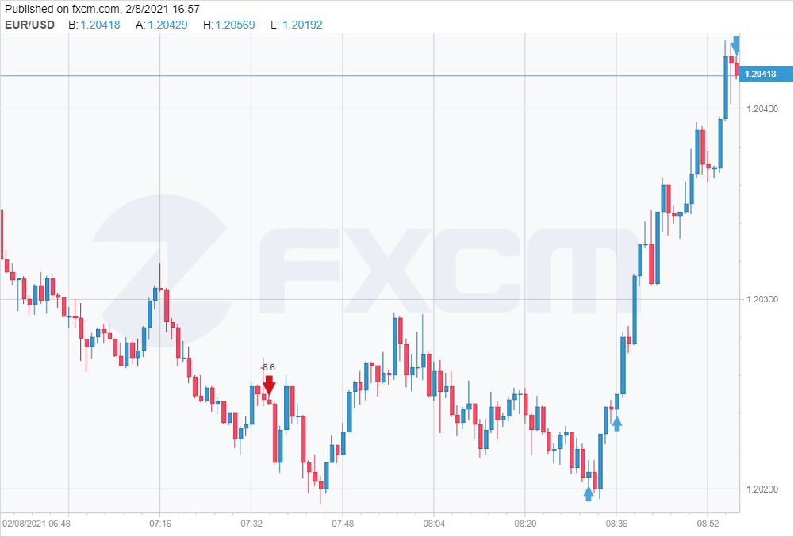

# Project Apatheia

This is an automated forex trading system built using python. The system uses a pre-trained [Reinforcement Learning model](https://github.com/Sianwa/DeepQNetworks_Project) to trade. Below is an example of how the model performes in the live market.

<<<<<<< HEAD
Live trading is made possible will the FXCM API and fxcmpy python library. Allowing the model the model to stream price changes and place market orders when as it makes predictions.
## Directory

 1. [Jupyter Notebooks](jupyter_notebooks) Contains the twitter scrapping notebook used to scrape tweets and pre-process them, and the streaming notebook used for testing the fxcm api endpoints.
 2. [Training Model](TrainingModel) Contains the algorithm used for training the reinforcement learning model and testing its performance on unseen data. The trained model was then saved in h5 files in [trained model files](TrainingModel/models)
 3. [Data](Data)Preprocessed data used for training and testing the model
 4. [Templates](templates) The web application html files
 5. [Live Bot](LiveBot.py) The reinforcement learning algorithm used in live trading
 

=======
Live trading is made possible will the FXCM API and [fxcmpy](https://github.com/fxcm/RestAPI/tree/master/fxcm-api-rest-python3-example) python library. Allowing the model the model to stream price changes and place market orders when as it makes predictions.
>>>>>>> 54850ebebd721ecac0b98d668d9afcbc89bcee41
********

## Requirements
To run the project ensure that you have
    1. Flask v1.1.2
    2. Python 3
    3. The necessary librarys listed in requirements.txt
    4. Linux environment to perform Redis Worker Queues.
    5. Redis v6.0.10

To run the project:
````````
#run in order in seperate terminals
$ redis-server
`````````
`````````
#to activate worker thread
$ rq worker

#to start server
$ flask run
```````````
******

## Model Performance
Below are some of the live trades performed by the model. They are indicated on the candle charts as either blue or red arrows.




## References
[q-trader](https://github.com/edwardhdlu/q-trader) 
